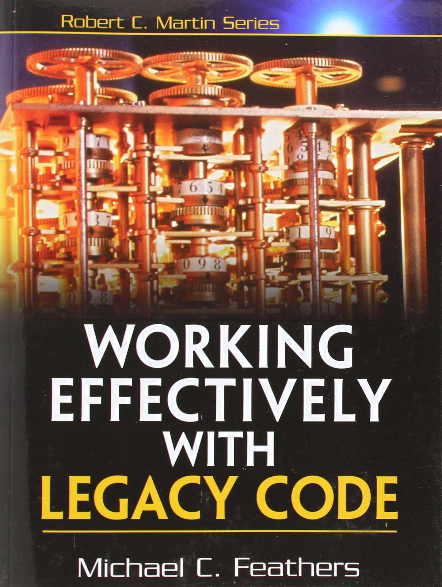

## Surviving a Legacy Codebase

<br/>
<br/>

#### *It's (probably) not as bad as you think*

<br/>
<br/>

Jeremy Thurgood

PyconZA 2017

$$$NOTES

$$$
$$$

<!-- .slide: class="center" -->

#### Prelude <!--{_style="opacity: 0.3"}-->

## What is legacy code?

<br/>

$$$

<br/>
<br/>

#### The very old definition <!--{_class="fragment frag-instant semi-fade-out"}-->

<br/>

### "Code for an obsolete computer" <!--{_class="fragment"}-->

$$$

<br/>
<br/>

#### The most common current definition <!--{_class="fragment frag-instant semi-fade-out"}-->

<br/>

### "Code inherited from someone else" <!--{_class="fragment"}-->

$$$

<br/>
<br/>

#### A more visceral definition <!--{_class="fragment frag-instant semi-fade-out"}-->

<br/>

### "Code you're afraid to modify" <!--{_class="fragment"}-->

$$$

<br/>
<br/>

#### A practical definition that points to a solution <!--{_class="fragment frag-instant semi-fade-out"}-->

<br/>

<div>
### "Code without tests"
#### _---Michael Feathers_
</div><!--{_class="fragment"}-->


$$$
$$$

<!-- .slide: class="center" -->

#### Act 1 <!--{_style="opacity: 0.3"}-->

## Get it tested

<br/>

$$$

### Write some tests

<br/>

<div>
<div>
All done, let's go home.


<!--{_width="20%"}-->
</div> <!--{_class="fragment frag-instant strike"}-->
</div> <!--{_class="fragment"}-->

<br/>
<br/>

### If only it were that easy. <!--{_class="fragment"}-->

$$$

<!-- .slide: class="morespaced" -->

### Why is it not that easy?

<div>

It just wasn't written to be testable.

* Spaghetti

* Giant functions

* Global mutable state

* Tightly coupled dependencies

</div> <!--{_class="fragment"}-->

$$$

### It gets worse over time

<br/>

Changing legacy code is scary.

<br/>

It doesn't get refactored. <!--{_class="fragment"}-->

<br/>

Things get hacked in. <!--{_class="fragment"}-->

$$$

### All is not lost!

<br/>

We can make legacy code testable.

<br/>

Very carefully. <!--{_class="fragment"}-->

<br/>

With limited, controlled changes. <!--{_class="fragment"}-->

$$$

#### Small example: `create_vm`

I want to modify this celery task...
```python
@app.task(time_limit=120)
def create_vm(vm, xenserver, template, name, **others):
    session = getSession(
        xenserver.hostname, xenserver.username, xenserver.password)

    storage = session.xenapi.SR.get_all()
    # ... Another 180 lines of VM creation using the session ...

```

<br/>

<div>
...but it creates a remote XenServer API session.
```python
def getSession(hostname, username, password):
    session = xenapi.Session('https://%s:443/' % (hostname))
    session.xenapi.login_with_password(username, password)
    return session

```

</div> <!--{_class="fragment"}-->

$$$

#### Small example: `create_vm`

Factor out everything that uses the session...
```pythonhl
@app.task(time_limit=120)
def create_vm(vm, xenserver, template, name, **others):
    session = getSession(
        xenserver.hostname, xenserver.username, xenserver.password)
    # $HL
    return _create_vm(session, vm, template, name, **others)

def _create_vm(session, vm, template, name, **others):
    # $HL
    storage = session.xenapi.SR.get_all()
    # ... Another 180 lines of VM creation using the session ...

```

<div>
...build a test double for the session object...
```python
class FakeXenServer(object):
    """Fake XenServer to use in tests."""
    # ... 300+ lines of implementation ...

```

</div> <!--{_class="fragment"}-->

...and then write some tests. <!--{_class="fragment"}-->

$$$

<!-- .slide: class="morespaced" -->

#### Things to note

We made one small change to the legacy code. <!--{_class="fragment"}-->

We did not change the behaviour of the legacy code. <!--{_class="fragment"}-->

<span>We did not change the signature of `create_vm`.</span> <!--{_class="fragment"}-->

We built a test double that will be useful elsewhere. <!--{_class="fragment"}-->

We can now start making safe, tested changes. <!--{_class="fragment vhc"}-->

$$$

<!-- .slide: class="lessspaced" -->

### Testing legacy code

##### Focus on the task at hand <!--{_class="fragment"}-->

* Only test the relevant code <!--{_class="fragment"}-->

* Hacks are okay <!--{_class="fragment"}-->

##### Write investigative tests <!--{_class="fragment"}-->

* "What does it do if I give it this input?" <!--{_class="fragment"}-->

* Copy "expected" values from actual output <!--{_class="fragment"}-->


$$$
$$$

<!-- .slide: class="center" -->

#### Act 2 <!--{_style="opacity: 0.3"}-->

## Tools and techniques

<br/>

$$$

### First, some tools

<div>
##### Static analysis
* flake8
* pylint
</div> <!--{_class="fragment"}-->

<div>
##### Automated refactoring
* PyCharm
* Rope
</div> <!--{_class="fragment"}-->

<div>
##### The human brain
</div> <!--{_class="fragment"}-->

$$$

### Breaking dependencies

Test doubles! <!--{_class="fragment"}-->

...but how do we get them in there? <!--{_class="fragment"}-->

<br/>

* Break up long functions <!--{_class="fragment"}-->
* Add parameters <!--{_class="fragment"}-->
* Encapsulate global references <!--{_class="fragment"}-->
* Use seams <!--{_class="fragment"}-->


$$$NOTES

Usually have to do this without tests.

$$$

#### Encapsulating a global dependency

Instead of using `reactor` directly, put it in an attribute...

```pythonhl
class SmppTransceiverTransport(Transport):
    # $HL
    clock = reactor
    # $HL
    # ... Quite a lot of transport implementation code ...

    def check_stop_throttling(self, delay=None):
        # ... A few lines of throttle-stop-checking code ...
        # $HL
        self._unthrottle_delayedCall = self.clock.callLater(
            delay, self._check_stop_throttling)
        # $HL

```

...then override that attribute in the test.

```pythonhl
def test_smpp_transport():
    clock = Clock()
    transport = SmppTransceiverTransport()
    # $HL
    transport.clock = clock
    # $HL
    # ... The rest of the test ...

```

$$$

### Seams

<br/>

"A seam is a place where you can alter behavior in your program without editing in that place." <br/>
_---Michael Feathers_

<br/>

<div>
* module imports
* function/method calls
* attribute lookups
</div> <!--{_class="fragment"}-->

$$$

### Exploiting seams

<br/>

Install a fake library <!--{_class="fragment"}-->

<br/>

Monkey-patch <!--{_class="fragment"}-->

<br/>

Subclass and override <!--{_class="fragment"}-->

$$$NOTES

fake-plastic-pycrypto

$$$

#### Breaking a dependency with a seam

```pythonhl
@app.task(time_limit=60)
def updateServer(xenserver):
    # $HL
    session = getSession(
        xenserver.hostname, xenserver.username, xenserver.password)
    # $HL
    # ... Dozens of lines of code to update a server ...
    for vmref, vmobj in allvms.items():
        # $HL
        updateVm.delay(xenserver, vmref, vmobj)
        # $HL
    # ... Dozens more lines of server-related code ...

@app.task(time_limit=60)
def updateVm(xenserver, vmref, vmobj):
    # ... A few lines of check and setup code ...
    # $HL
    session = getSession(
        xenserver.hostname, xenserver.username, xenserver.password)
    # $HL
    # ... Dozens of lines of code to update the VM ...

```

We could extract `getSession()` as we did before...

...by making nontrivial changes to untested code. :-( <!--{_class="fragment"}-->

$$$

#### Breaking a dependency with a seam

<br/>

Instead, we monkey-patch in our own `getSession()`.

<br/>

```pythonhl
def test_updateServer(monkeypatch):
    from xenserver import tasks
    from xenserver.tests.helpers import XenServerHelper
    xshelper = XenServerHelper()
    # $HL
    monkeypatch.setattr(tasks, 'getSession', xshelper.get_session)
    # $HL
    # ... Way too many lines of code to test updateServer() ...

```

<br/>

It's ugly, but we know we didn't break anything. :-) <!--{_class="fragment"}-->

$$$

<!-- .slide: class="lessspaced" -->

### Changing untested code

Separate new code from old. <!--{_class="fragment"}-->

<div>
##### Pros:
* New code can be tested in isolation
* Changes to old code are restricted
</div> <!--{_class="fragment"}-->

<div>
##### Cons:
* Spaghetti with meatballs
* Old code doesn't improve
</div> <!--{_class="fragment"}-->

<br/>

Use with care, clean up later. <!--{_class="fragment vhc"}-->

$$$

<!-- .slide: class="morespaced" -->

### The legacy code algorithm

1. Identify code that needs to change

2. Break dependencies

3. Write tests

4. Make changes

5. Refactor (where possible)

$$$

### Read this book


<!--{_width="40%"}-->


$$$
$$$

<br/>
<br/>
<br/>

## The end of the slides

Now you get to ask me hard questions.

(Or easy questions. I prefer those.) <!--{_class="fragment"}-->

<br/>
<br/>
<br/>

<div class="imgcreds">
Image credits:</p>
Unicorn cat from [animalsclipart.com](http://animalsclipart.com) (CC By 4.0)</p>
Book cover from [amazon.ca](https://www.amazon.ca/Working-Effectively-Legacy-Michael-Feathers/dp/0131177052) product page
</div>
